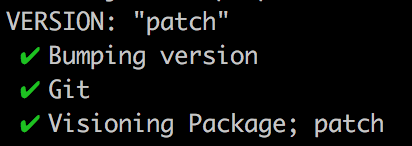

I recently messed up creating a new version in work. I ran our normal version script which boils down to
`npm version major | minor | patch`. We have a bunch of commit and version hooks that take care of the rest of our
version process. However this time I run the script I messed up! I when to push the new git tag that the version script
creates. The was rejected as the tag already existed. I did the cardinal sin and forgot to pull the latest master before
I ran any processes locally.

## In comes Safe Version
From this I decided to create a version script that would run checks for me and give feedback. So after checking that the
name **safe-version** was not taken on npm I jumped at the chance to release a [new npm module](https://github.com/chrislaughlin/safe-version).

## Usage

If you want to use **safe-version** in your project you can follow the below steps:

- Install safe release via [npm](https://www.google.co.uk/search?q=installing+npm&rlz=1C5CHFA_enUS723GB724&oq=installing+npm+&aqs=chrome..69i57j0l5.2815j0j7&sourceid=chrome&ie=UTF-8) using the following command `npm i safe-version`
- Add a new script to your _package.json_ file that runs the following ` npm bump: "safe-version"`
- Then when increasing the project version run the following command `npm run bump -- --patch`

If you find this useful check out the [module](https://github.com/chrislaughlin/safe-version) and if you find any issues
 or bugs feel free to great an [issue](https://github.com/chrislaughlin/safe-version/issues?q=is%3Aissue+is%3Aopen+sort%3Aupdated-desc)
 or [pull request](https://github.com/chrislaughlin/safe-version/pulls?q=is%3Apr+is%3Aopen+sort%3Aupdated-desc).