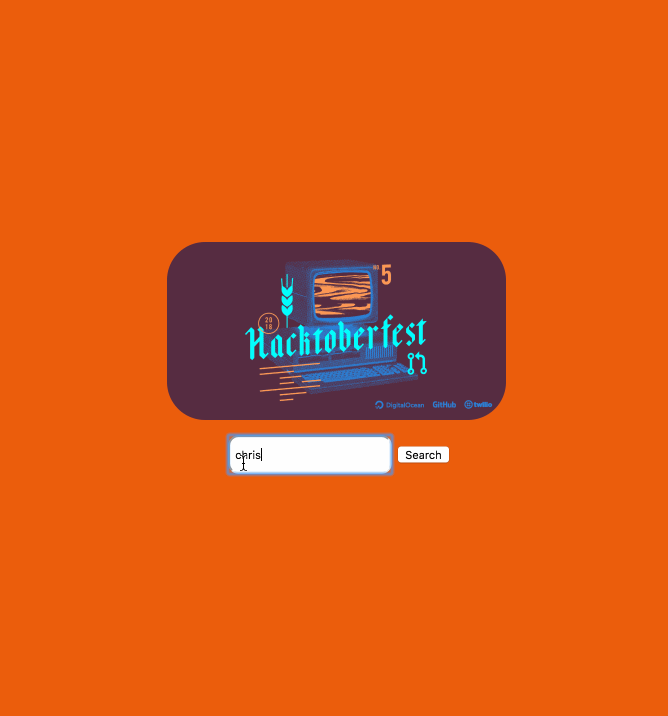

As part of Hacktoberfest you need to at least open 5 pull requests to get the sticker and t-shirt. I remember last year
seeing a status tracker that could check your progress. So this year I thought I would build out my own tracker. Also
this gave me a chance to play with [TypeScript](https://www.typescriptlang.org/) and a great excuse to use the amazing
[codesandbox](https://codesandbox.io).

The basics of building the app was to find a way to search a Github user and get a list of the pull requests they have
opened. Thankfully Github has a easy to use [search tool](https://github.com/search). I tested out the query I needed:

```
author:chrislaughlin -created:<=2018-10-01 -created:>=2018-11-01
```

I can then use this with the Github API `https://api.github.com/search/issues?q=author:${username} -created:<=2018-10-01 -created:>=2018-11-01`.
Once I got this working I could build out a very simple and not good looking app to allow users to enter a username and
then search for pull request data.



You can see the code and try it out yourself below:

<iframe src="https://codesandbox.io/embed/yq418jy77x?autoresize=1" style="width:100%; height:500px; border:0; border-radius: 4px; overflow:hidden;" sandbox="allow-modals allow-forms allow-popups allow-scripts allow-same-origin"></iframe>