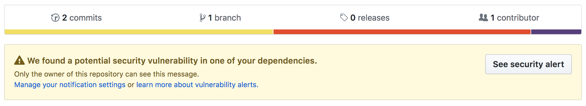

After listening to a recent episode of the [React Podcast](https://reactpodcast.simplecast.fm/33) on which
[Michael Chan](https://twitter.com/chantastic) was talking to [Laurie Voss](https://twitter.com/seldo/) from the npm team.
At the end of the episode Laurie talked about [npm audit](https://docs.npmjs.com/cli/audit). This is a new feature added to the npm tool. This has been on my
radar for while now but I have never got around to trying it out. Well today is the day.

Npm audit is a tool that allows to you maintain the security of your Javascript project. As open source software grows
it is certain that vulnerabilities are found. This is at no fault to the developers who build the open source projects or
the developers that consume these. Security is hard to build into software. So lets look at an example.

I found a know vuln in [jQuery](https://github.com/chrislaughlin/npm-audit-example/network/alert/package.json/jquery/open)
and decided to build a [dummy project](https://github.com/chrislaughlin/npm-audit-example) with this version of the library.
After running `npm install` on the project I can see already that npm has found the vulnerable version and shows a message:

```bash
added 764 packages from 646 contributors and audited 7903 packages in 17.374s
found 1 high severity vulnerability
run `npm audit fix` to fix them, or `npm audit` for details
```

So from here I could just run `npm audit fix` but I want to know more. So I decide to run `npm audit`:

```bash

                       === npm audit security report ===

# Run  npm install jquery@3.3.1  to resolve 1 vulnerability
SEMVER WARNING: Recommended action is a potentially breaking change
┌───────────────┬──────────────────────────────────────────────────────────────┐
│ High          │ Cross-Site Scripting (XSS)                                   │
├───────────────┼──────────────────────────────────────────────────────────────┤
│ Package       │ jquery                                                       │
├───────────────┼──────────────────────────────────────────────────────────────┤
│ Dependency of │ jquery                                                       │
├───────────────┼──────────────────────────────────────────────────────────────┤
│ Path          │ jquery                                                       │
├───────────────┼──────────────────────────────────────────────────────────────┤
│ More info     │ https://nodesecurity.io/advisories/328                       │
└───────────────┴──────────────────────────────────────────────────────────────┘


found 1 high severity vulnerability in 7903 scanned packages
  1 vulnerability requires semver-major dependency updates.
```

Now I have a clear view of the security issues found, as suspected its a version of jQuery that contains a cross site
scripting issue. I could just run fix command however as stated above the new version is a major change to the library
and I should take action with caution as this could break functionality in the application. The best action would be to
upgrade the version and run a full test of the application.

Github has also now added features to help keep your apps safe. Github will check repos for vulnerable packages and
display warning messages to the owners like below:



So out there and audit your project you might be surprised what you find and its also great chance to upgrade old
packages that could improve your application.
