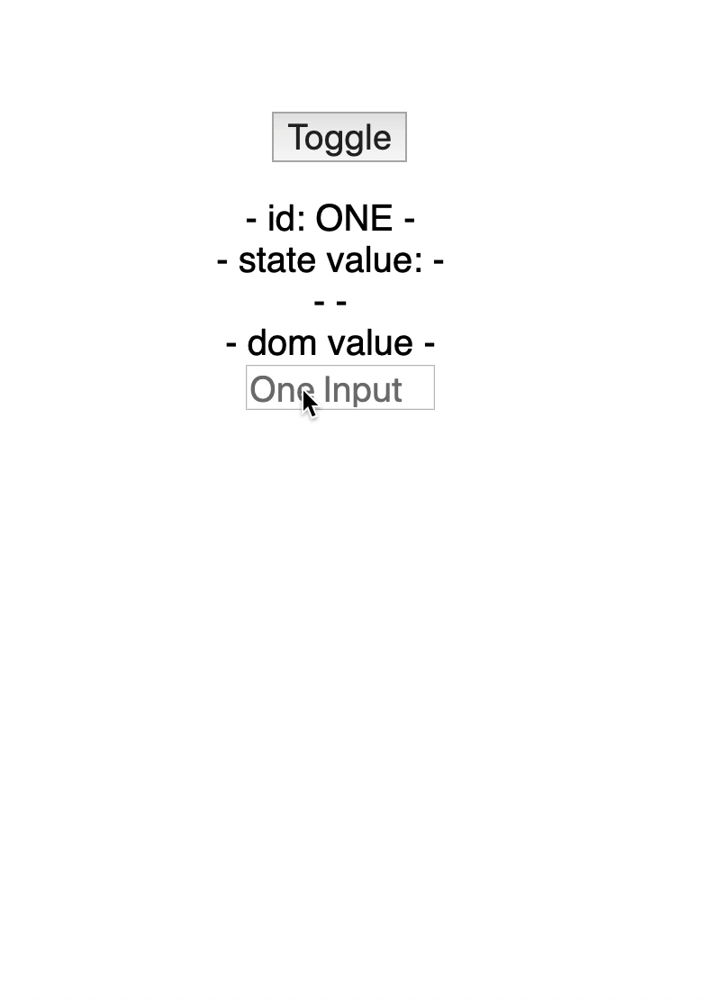
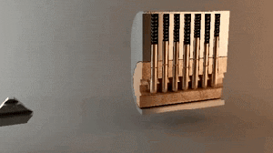

Have you ever mapped over a list in React and built a list of DOM nodes or list of components? Have you ever been told by
your IDE that you need to add a key prop or eslint fails to build because you don't have a key prop on each item. If you are
like most people you just add the index from the map function as the key. This will work in most cases however it can cause
some random edge cases.

If you don't know what react key props are and how they work I'm not the man to tell you, reading [this](https://reactjs.org/docs/lists-and-keys.html) should give you a
good understanding.

So what are these edge cases I have mentioned? Recently in work I ran into a case where using a index value for a key would
result in a the same two components rendering with the same DOM values. Let see an example:



In the above example I have a toggle button that changes which Inputs should be shown Either input `ONE` or input `TWO` and
`THREE`. This is done via a very simple form generation component that takes an array of inputs and renders as many `<input />`
 components needed. This is where our key prop comes into play as we are looping over an array and rendering components.
 In many cases I would use the array method index for the prop as this is a simple way tro handle the kep props.

 ```javascript
 array.map((item, index) => {
   return (
     <span key={index}>{item.value}</span>
   );
 });
 ```

 If you read the docs linked at the start you would know this is not advice and the gif above shows why. Looking deeper into the
 example we can see that the first input has an id of ONE when we toggle we have two input one with id of TWO and the other
 with an id of THREE. But when we enter text into input ONE and toggle the value is still shown in input TWO. THos value
 is not present in the state for input TWO but still show how shows. This is related to how react handles virtual dom diffs
  and how it read the key prop. If you think how array index's aee generated when we toggle input ONE and TWO will both have
 the same index (0). So when the DOM re-renders the text value of the input persists.

Id's to the rescue!

We can update the above code to fix this with one simple change. We can use a uniq identifier on our items. In most cases
when rendering a list in react you have fetched the data from a server and this data should have a id or uuid on each item.
We can take advantage of this to make the key prop a real uniq identifier for the element we have rendered.

```javascript
 array.map((item) => {
   return (
     <span key={item.id}>{item.value}</span>
   );
 });
 ```


