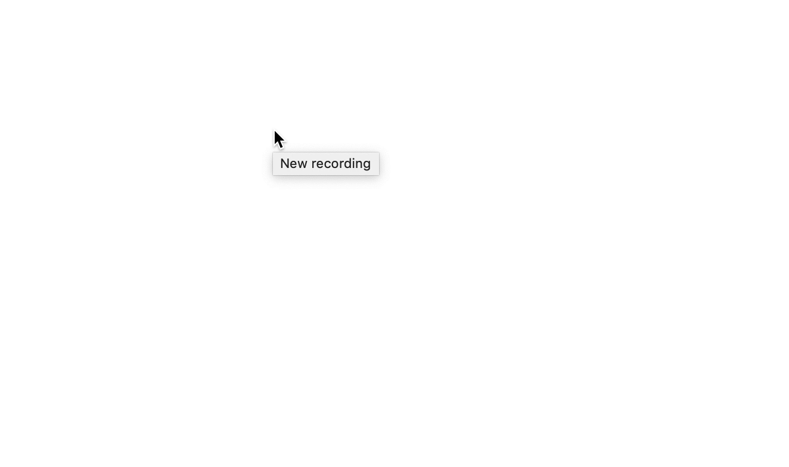

If you are old like me, or are a gamer then you might remember the Konami Code.The code is
⬆️⬆️⬇️⬇️⬅️➡️⬅️➡️B A  Doing this on your game controller usually unlocked some hidden feature or give
you some super powers.

So whats this got to do with JavaScript?

I have recently been trying to use React Hooks more and this was a good chance to make something useless that would teach me
about hooks.

Lets looks at the basic parts that we need to handle the Konami Code:
- Capture key presses from the user
- Keep track of the keys the user has entered
- If the key pattern matches the code return true
- Clear the key pattern if no activity

## Capture key presses from the user

We can use the browser API to capture all keypress actions. Using `document.onkeydown` we can use `document.onkeypress` however
this does not capture the arrow keys.

## Keep track of the keys the user has entered

We need to store the keys pressed in some state, we can use the `useState` hook.

```javascript
const [keys, setKeys] = useState([]);

document.onkeydown = e => {
    setKeys(currentKeys => [...currentKeys, getKeyName(e.keyCode)]);
};
```

The getKeyName func is just a simple check against the key code

```javascript
const getKeyName = keyCode => {
  switch (keyCode) {
    case 37:
      return "left";
      break;
    case 38:
      return "up";
      break;
    case 39:
      return "right";
      break;
    case 40:
      return "down";
      break;
    case 65:
      return "A";
      break;
    case 66:
      return "B";
      break;
  }
};
```

## If the key pattern matches the code return true

To do this we can export a `isKonamiCode` bool that will tell the consuming package if the user has entered the code.

```javascript
return {
    isKonamiCode: isKonamiCode(keys),
    keys
};
```
We also export the keys typed encase the consumer wants to log these.

## Clear the key pattern if no activity

Lastly we need to clear the keys entered after a set time of no activity. We can do this using setTimeout

```javascript
let timeout;
document.onkeydown = e => {
    clearTimeout(timeout);
    setKeys(currentKeys => [...currentKeys, getKeyName(e.keyCode)]);
    timeout = setTimeout(() => {
      setKeys([]);
    }, 3000);
};
```

This hook only made use of `useState` however it was a simple way to get more exposure to react hooks and make something fun at the same time.
When we put everything together we have the full hook `useKonamiCode`

```javascript
const getKeyName = keyCode => {
  switch (keyCode) {
    case 37:
      return "left";
      break;
    case 38:
      return "up";
      break;
    case 39:
      return "right";
      break;
    case 40:
      return "down";
      break;
    case 65:
      return "A";
      break;
    case 66:
      return "B";
      break;
  }
};

const isKonamiCode = codes => {
  return codes.join(" ") === "up up down down left right left right B A";
};

const useKonamiCode = () => {
  const [keys, setKeys] = useState([]);
  let timeout;
  document.onkeydown = e => {
    clearTimeout(timeout);
    setKeys(currentKeys => [...currentKeys, getKeyName(e.keyCode)]);
    timeout = setTimeout(() => {
      setKeys([]);
    }, 3000);
  };

  return {
    isKonamiCode: isKonamiCode(keys),
    keys
  };
};
```

Then to use this in a component:

```javascript
function App() {
  const { isKonamiCode, keys } = useKonamiCode();
  return (
    <div className="App">
      <h1>{isKonamiCode && <b>isKonamiCode</b>}</h1>
      <h3>{keys.join(", ")}</h3>
    </div>
  );
}
```



